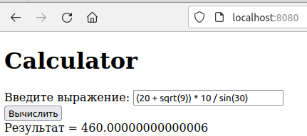
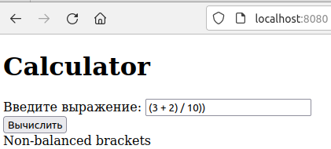

# vniizht-calculator

## Projects

### [Calculator-back](calculator-back)

### [Calculator-front](calculator-front)

### Как запустить приложение

В проекте calculator-back уже находятся откомпилированные файлы frontend, поэтому можно
собрать и запустить jar обычным способом:
* перейти в директорию проекта calculator-back
* выполнить команду `mvn package`
* перейти в директорию target и запустить находящийся там после сборки файл `zhtcalculator-0.0.1-SNAPSHOT.jar`
    * `java -jar zhtcalculator-0.0.1-SNAPSHOT.jar`
* открыть в браузере `http://localhost:8080/`
* появится окно калькулятора с полем для ввода выражения

